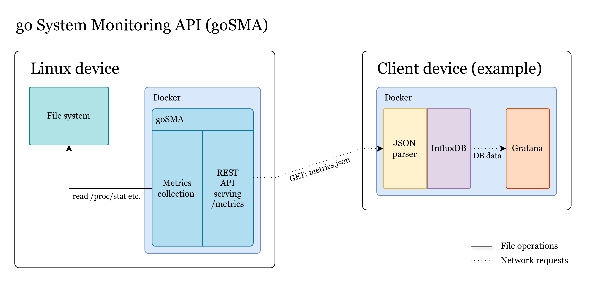

## go System Monitoring API (goSMA)

### About
This RESTful API allows for fetching metrics like CPU usage or network throughput of the host system.



### Development
```bash
git clone https://github.com/blccming/goSMA
cd ./goSMA
# Using docker
docker compose up --build
# Running bare metal
go run .
```

### Running
Either use the docker-compose in `examples/standalone` via `docker compose up -d` or run the provided binary.

### Configuration
goSMA makes use of environment variables for configuration:

| Environment variable | Description                                                                                                                    |
| -------------------- | ------------------------------------------------------------------------------------------------------------------------------ |
| `PORT`               | Changes the port goSMA runs on. If you're using docker, you can configure this via the `ports:` section in the `compose.yml`.  |
| `UPDATE_INTERVALL`   | Changes the time between updates to the data that's being made available through the API. Time is in seconds (float possible). |
| `HOSTNAME`           | Overwrites the hostname that is being read from `/etc/hostname`.                                                               |
